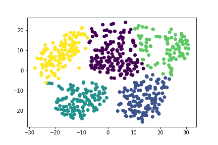

# Unsupervised Myopia Clustering  
  
Using clustering algorithms to explore whether patients can be placed into distinct groups, to better predict myopia.  
  
The .csv file containing the dataset used is located within the Resources folder. The relevant code, visualisations, and written conclusion can be found within the Myopia.ipynb file.  
  
---------------------
  
After preprocessing the dataset, dimensionality reduction was applied via PCA and t-SNE. A cluster analysis was then performed with K-means, and an elbow curve was generated and used to identify the best number of clusters.  
  

    

   
From my analysis of the data, my recommendation is to group patients into 5 distinct clusters, as shown in the above figure.  
  
--------
  
The dataset used for this project is a reduced dataset from [Orinda Longitudinal Study of Myopia conducted by the US National Eye Institute](https://clinicaltrials.gov/ct2/show/NCT00000169).  
